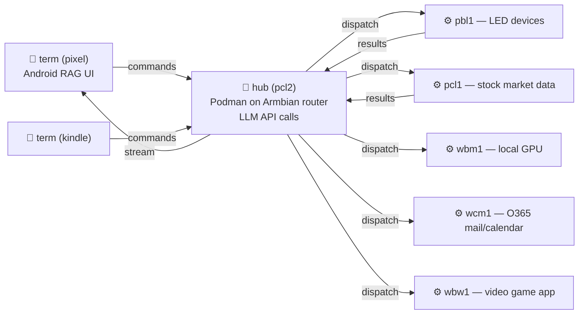

> 📦 **Part of the [Daemon multi-version archive](https://github.com/mikesmullin/daemon).** This is **v4** — a C99 rewrite (built from Game9 engine pieces): a fast, cross-platform, distributed hub/worker harness. The most performant line.
>
> **Versions:** [v1](https://github.com/mikesmullin/daemon/tree/v1) · [v2](https://github.com/mikesmullin/daemon/tree/v2) · [v3](https://github.com/mikesmullin/daemon/tree/v3) · [v4](https://github.com/mikesmullin/daemon/tree/v4) · [v2-web-ui](https://github.com/mikesmullin/daemon/tree/v2-web-ui) · [overview](https://github.com/mikesmullin/daemon)

---

# 👺 Daemon v4

**A distributed, multi-machine agentic-AI platform written in C99.**

Where v1–v3 were single-machine Bun/`.mjs` runtimes, **v4 is a clean-room rewrite in portable C99**
built from the performance-tuned, cross-platform pieces of my game engine (**Game9**). A single tiny
binary — `d4` — networks many machines into one cluster, routes AI agent work between them, and runs
tool calls wherever the right hardware lives: a GPU box, a router, a phone, a Windows gaming PC.

It is the fastest and most portable line of Daemon, and the direct ancestor of my later projects
[`subd`](https://github.com/mikesmullin/subd) → [`wasm1`](https://github.com/mikesmullin/wasm1) →
[`agl-ai`](https://github.com/mikesmullin/agl).

## What makes v4 distinct

- 🧩 **One binary, three roles.** The same `d4` executable runs as a **hub** (router + LLM caller),
  a **term** (thin client / reverse-shell-like UI), or a **worker** (tool executor). A cluster is
  1 hub, 1–3 terms, and many workers.
- 🛰️ **Custom reliable, encrypted UDP netcode.** A from-scratch game-engine-style network stack:
  ring buffers for zero-copy I/O, stop-and-wait ARQ for guaranteed delivery, **ChaCha20** payload
  encryption + **CRC32** integrity, per-client sessions, and a Quake-style per-frame pump. Each
  source file is kept **under ~1k lines** with minimal stdlib dependency (portable enough for
  microcontroller/console targets).
- 🌍 **Genuinely cross-platform.** Linux, macOS, Windows, and the **browser** (Emscripten/WebSocket)
  share one unified socket interface (TCP / UDP / Unix-domain / WebSocket) behind async callbacks.
- ⚙️ **ECS + Behavior-Tree execution.** Commands run as **pure, time-sliced tick functions** with
  explicit FSM state (`PENDING → RUNNING → COMPLETED/FAILED`), driven by an ECS-style per-frame
  system — so long-running tools (shells, HTTP) never block the loop.
- 🔀 **Distributed tool-call batching.** When the LLM returns several tool calls, the hub fans them
  out to different workers and **re-aggregates the out-of-order results in order** before submitting
  back to the LLM API — solving the batching contract that single-machine designs ignore.
- 🗂️ **File-based human-in-the-loop.** Approvals/questions use `FS.await` on well-known files
  (`~/.d4/approvals.txt`) instead of bespoke protocol messages — simpler, auditable, scriptable.
- 🧠 **Arena-only memory.** No `malloc` in the hot path; all allocation goes through an arena
  allocator, per the project's C99 style guide.

## Architecture

### Roles

| Role | Count | Responsibility |
|------|-------|----------------|
| **hub** | exactly 1 | Central router; calls the LLM APIs; owns sessions; aggregates tool batches. |
| **term** | 1–3 | Thin client. Sends user input → hub, prints streamed output. Cannot run tools. |
| **worker** | many (~90%) | Executes dispatched tool calls. Bare-metal (hardware/GPU) or container (safe isolation). |

All traffic flows **through the hub** for centralized tracking — both dispatch and responses.

### Example cluster topology



Nodes use an informal naming convention — `[scope][hardware][os][n]`, e.g. `pbl1` = **p**ersonal
**b**are-metal **l**inux machine **1**. Terms (`pixel`, `kindle`) are free-named Android handsets
running a [mintty](#companion-projects)-based RAG terminal.

### Network protocol (the fun part)

A reliable layer over UDP, assembled from these `common/` primitives:

- **`Sock.c`** — one socket abstraction over TCP, `udp://`, `unix://`, and WebSocket (Emscripten),
  all via async callbacks.
- **`RingBuffer.c`** — circular buffers (`push`/`shift`/`peek`) with wrap-around for zero-copy I/O.
- **`IO.c`** — type-safe scalar (de)serialization with transaction rollback (`IO_Begin` /
  `IO_RollbackOrCommit`) and variable-length `VInt32`.
- **`Message.c`** — `NetFrame` (de)serialization: ChaCha20 encryption, CRC32, `seq`/`ack` headers.
- **`Network.c`** — the Quake-style per-frame pump: drain inbound → parse frames → dispatch
  messages; compose outbound → encrypt → send (only when data is pending).

Each socket carries four ring buffers (`reliable`, `unacked`, `datagram`, `inbound`) implementing
stop-and-wait ARQ with 10s retransmit. For a multi-client hub, **per-client `NetSession`s** isolate
peer address, sequence state, and keys so concurrent clients don't clobber each other.

### Command & session model

- **`CmdMessage`** — one unified message type for all command traffic (`id`, `parent_id`, `term`,
  `worker`, `cmd`, `args`, `result`, `state`, `progress`), using `Str8` (ptr+len) for arena-friendly
  variable-length fields.
- **Behavior-Tree tick model** — commands are pure functions `(prev_state, cmd) -> new_state`
  visited each loop iteration via a lock-free `CmdRegistry` (single-threaded by design).
- **Session FSM** — `pending → running → {paused, stopped, success, error}`, with `Session.fork`,
  `continue`, `pause`/`restart`, and the rest exposed as hub-only tools.

## Agent templates

YAML templates define the model, allowed tools, and — uniquely for v4 — **which workers** may run
each tool (with primary/fallback ordering):

```yaml
tools:
  - name: Shell.exec
    workers: [worker1, worker2]   # try worker1, fall back to worker2
meta:
  limit: 20                        # max LLM turns before the session fails (loop guard)
```

Templates also support **EJS-style interpolation** in `system_prompt`, filled from `--data` YAML at
launch. Bundled examples: `home.yaml` (LED/home automation via `govee`/`openrgb`), `solo.yaml`,
`test.yaml`, `tooltest.yaml`.

## The `d4` CLI

```
d4 [-v...] [-r/--role <term|hub|worker>] [-h/--hub <ip:port>] \
   [-t/--template <file.yaml>] [-d/--data <yaml>] [-s/--session <node:id>] <prompt...>
```

- **Hub server mode:** `d4 -r hub -v` (no prompt) → long-running listener (systemd/Podman friendly).
- **Worker mode:** `d4 -r worker -h 10.1.10.1:6543 -v` → connects to hub, executes dispatched tools.
- **Oneshot:** `d4 -t tooltest -v "What is 2+2?"` → run once and exit.
- **Layered verbosity:** `-v`→tools, `-vv`→session, `-vvv`→LLM/XAI, `-vvvv`→network (hexdumps),
  `-vvvvv`→messages, `-vvvvvv`→raw IO. Each level is a strict superset of the last.

## Operation modes

- **STANDARD** — append-only context window (best coherence; bounded by context length).
- **ENDLESS** *(experimental)* — sends only the first prompt, last response, tool list, and a
  **blackboard** the agent maintains itself; lets a session run indefinitely if the agent manages
  its own memory well.
- **TREE** *(research)* — agents spawn subagents that return only summaries, scaling total effective
  context via depth.

## Building & deploying

`d4` builds with Clang (see `clang_options.rsp`, `compile_commands.json`, `cscope`) via the `Makefile`:

```bash
make            # native build
make alpine     # multi-arch container image (amd64 + arm64) via Podman + Dockerfile.alpine
```

The Make targets also cover arm64 export and pushing the image to an Armbian router node, where the
hub runs as a container under systemd/Quadlet. ChaCha keys are supplied via the `D4_CHACHA_KEY` /
`D4_CHACHA_NONCE` environment variables (shared cluster secret; values redacted from this archive).

## Engineering principles

From [`CODE_STYLE.md`](ai/docs/CODE_STYLE.md): C99 only, arena-based memory, ECS architecture, strict
naming conventions, loop/bounds safety, hot-reload compatibility, cross-platform determinism, and a
per-file "manifest" doc-comment style. Every networking source file is intentionally **< ~1k lines**
with minimal stdlib reliance, keeping microcontroller/console ports within reach.

## Companion projects

Built alongside v4 (mentioned for context; not included here):

- **mintty** — Android app giving a tappable chat/RAG `term` UI (the `pixel` / `kindle` nodes).
- **router** — home-router utility routing traffic between the mobile app and the cluster (WAN→LAN).
- **tap** — CLI for sending keystrokes to / remote-controlling a phone.
- **Game9** — game engine whose netcode, ring buffers, ECS, and cross-platform sockets seeded v4.

## Documentation

Deeper design docs live under [`ai/docs/`](ai/docs/):
[ROLES](ai/docs/ROLES.md) ·
[NET_TOPO](ai/docs/NET_TOPO.md) ·
[NET_PROTO](ai/docs/NET_PROTO.md) ·
[NET_CODE](ai/docs/NET_CODE.md) ·
[AGENT_SESSIONS](ai/docs/AGENT_SESSIONS.md) ·
[AGENT_TEMPLATES](ai/docs/AGENT_TEMPLATES.md) ·
[TOOL_CALLS](ai/docs/TOOL_CALLS.md) ·
[CODE_STYLE](ai/docs/CODE_STYLE.md)

## License

MIT — see [LICENSE](LICENSE).
