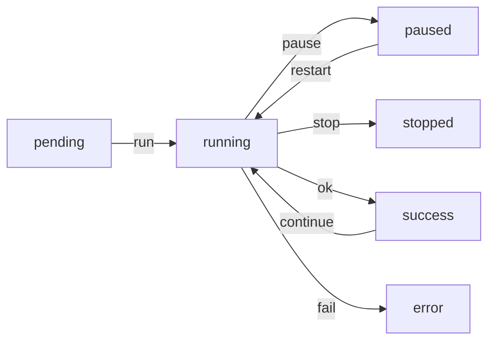

# Agent Sessions

Agent Sesions are stored on disk under `assets/agent/sessions/<session_id>.yaml` files.
Each session begins its life as a copy of an agent template (see `AGENT_TEMPLATES.md`).

A `session_id` is a zero-indexed incrementing unsigned integer. Each node is responsible for tracking/incrementing its own session_ids. Globally (as in one node referencing a session on another node), any reference to a session_id should be considered as (`node_name`+`session_id`). But locally (as in file names on local filesystem) it can just be referred to as (`session_id`).

## Session flow

### FSM

The state of a session can only exist in one (at a time) of 6 possible states:

Where (the ways it is possible to transit between those states) can occur when (for each case) (one of the following are true):

- `run`:
  - **User-initiated**: a user issues a prompt (ie. via `term` `agent <template> <prompt>` cli command) (see `NET_MSGS.md`)
  - **Agent-initiated** (e.g., Agent launching Subagent): an agent issues a `tool_call` `Session.create` (see `TOOL_CALLS.md`)
- `pause`:
  - User issues pause command
  - Agent issues `Session.pause` tool_call
- `restart`:
  - User issues restart command
  - Agent issues `Session.restart` tool_call
- `stop`:
  - User issues stop command
  - Agent issues `Session.stop` tool_call
- `ok`:
  - Agent loop, when LLM returns `finish_reason: stop`
- `continue`:
  - User issues an additional prompt (to an existing session)
  - Agent issues `Session.append` tool_call
- `fail`: 
  - Agent loop, when any unexpected error occurs, which prevents further iteration.

In most designs (various versions of daemon), there is a 1:1 mapping of User initiated CLI Commands to tool_call fns,
which makes the code DRYer considering that we only have to implement tool_call fns (and everything else (CLI commands) eventually leads to a tool_call function (the `help` cli command being the only exception, because it is invoked only locally to the `term`).

## Session Storage

The authoritative copy of a session is stored in process memory. This is because it is frequently referenced and mutated, And there is only ever one process that is capable of mutating a single session (single-threaded loop).
This is accompanied by periodic (Usually once per agent loop iteration, at the end of the loop) persisted snapshots to the disk (in the form of a YAML file);
That way the session can be recovered, after process crashes.

## Session Recovery

The current state of a session is important because it can determine what the next appropriate step is to recover the session.
For example, when the process starts, if it finds a session file that was in a running state, It can resume running that session automatically.

For this reason, each session file is read once at process startup. But it is less important that the session file be re-read from disk during normal operation.

