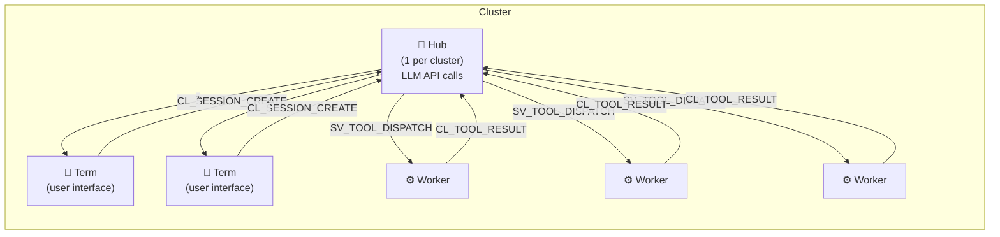
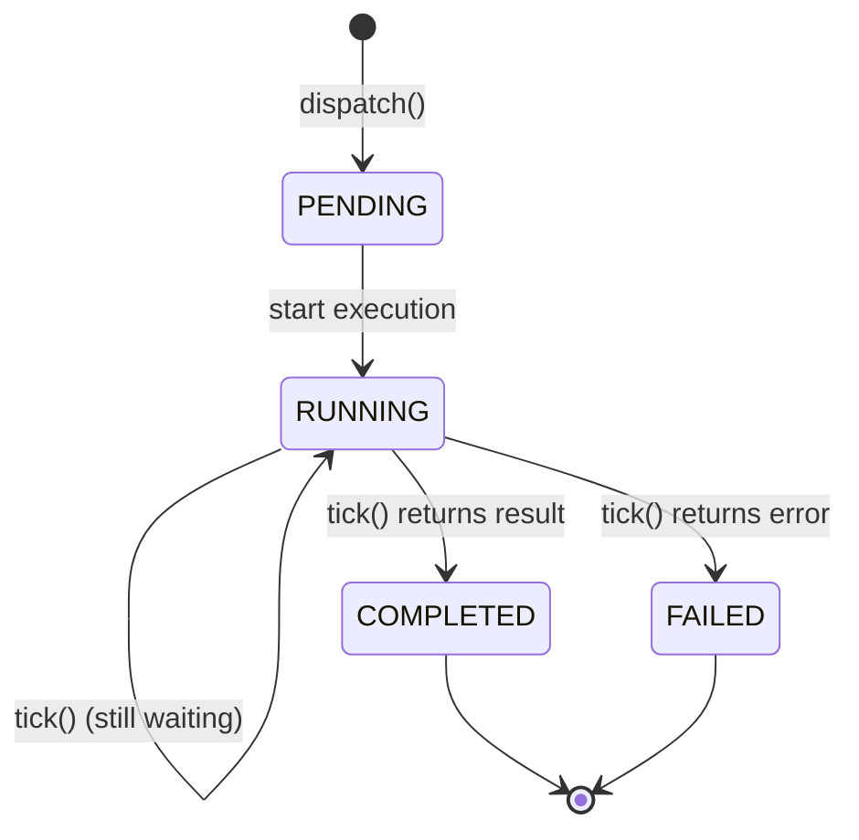
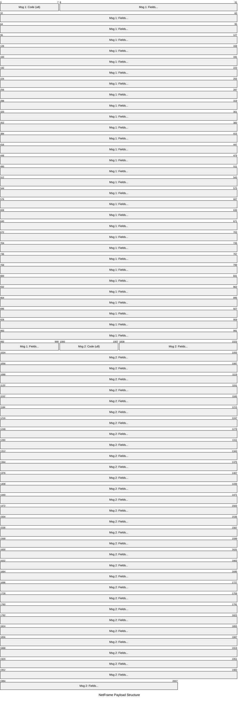
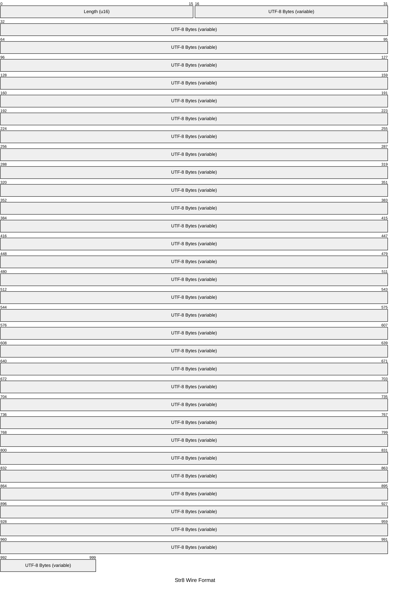
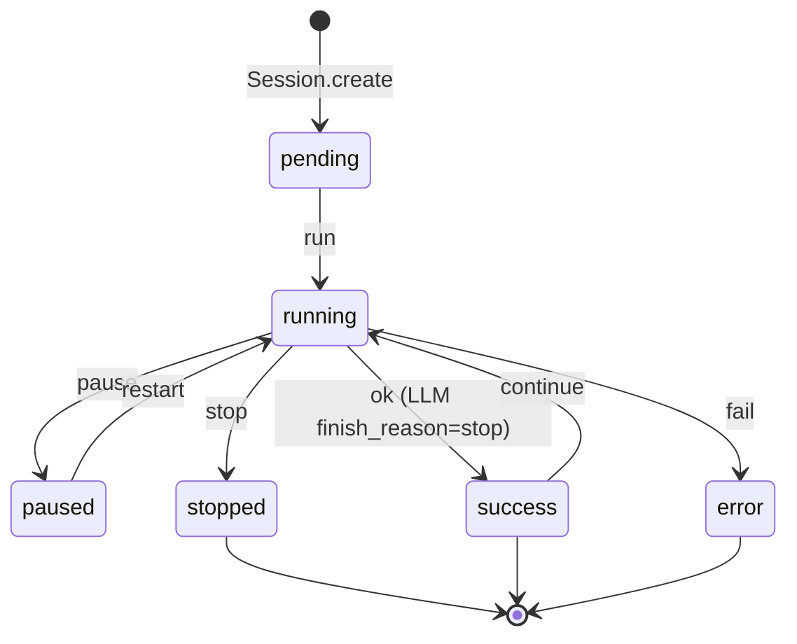
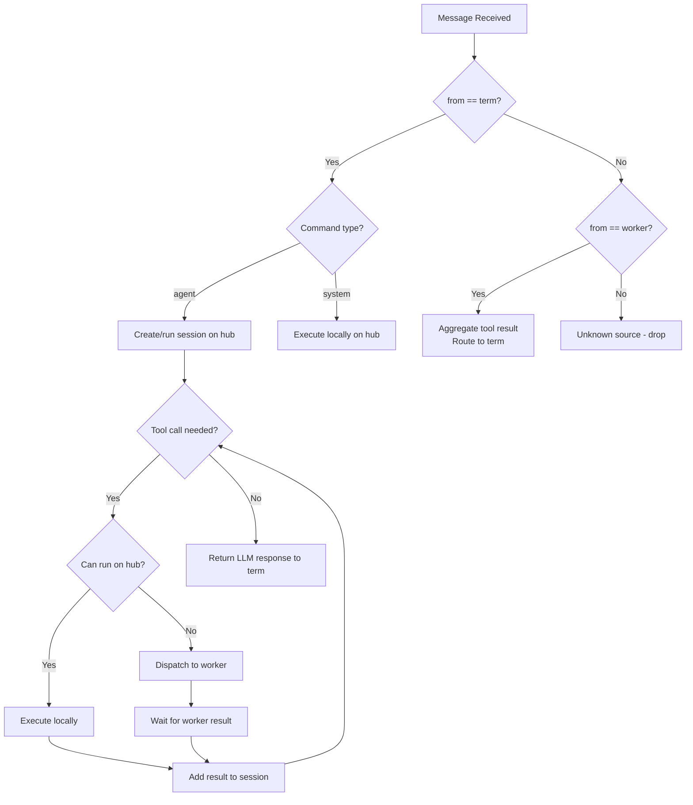
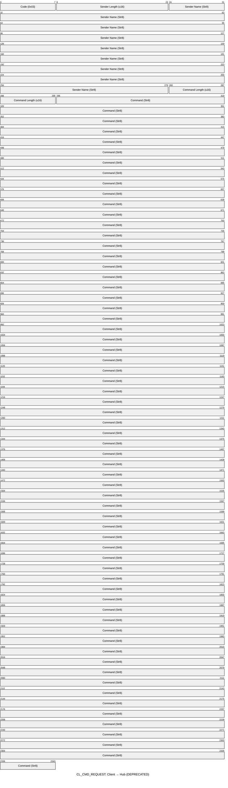
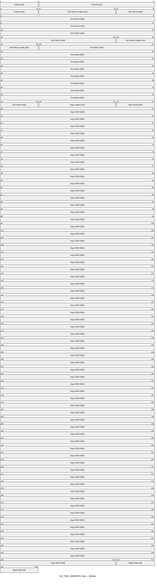
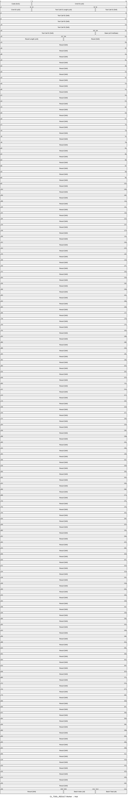

# Network Code (NetCode)

- **Related**: [NET_MSGS_V2.md](NET_MSGS_V2.md), [NET_PROTO.md](NET_PROTO.md), [AGENT_SESSIONS.md](AGENT_SESSIONS.md), [TOOL_CALLS.md](TOOL_CALLS.md), [ROLES.md](ROLES.md) |

---

## Abstract

This RFC specifies the command message layer for daemon-v4 (`d4`), describing the wire format, data structures, state machines, and routing semantics for commands exchanged between cluster nodes (`term`, `hub`, `worker`). This refactor introduces a unified `CmdMessage` structure with Behavior Tree-inspired FSM execution, tool call batching for LLM API compliance, and simplified role-based routing.

---

## 1. Motivation

### 1.1 Problem Statement

Previous daemon versions (`d3`) suffered from complexity in the network message layer:

1. **Overcomplicated message structures**: Redundant fields (`uuid req, res`, `sid from, to, as`) made parsing and routing error-prone.
2. **Approval workflow complexity**: Embedding approval/rejection logic in the protocol added unnecessary state.
3. **No formal command execution model**: Commands executed synchronously, blocking other requests.
4. **LLM tool call batching mismatch**: LLM APIs (OpenAI, xAI) require all tool results submitted together; the old design didn't aggregate out-of-order worker responses.

### 1.2 Goals

1. **Unified message structure**: One `CmdMessage` type for all command-related traffic.
2. **Behavior Tree execution**: Pure-function, time-sliced command execution with explicit state tracking.
3. **Role-based routing**: Explicit `term` (originator) and `worker` (executor) fields; hub is implicit.
4. **Tool call batching**: Hub aggregates out-of-order worker responses before LLM API submission.
5. **File-based human-in-the-loop**: Remove approval messages; use `FS.await` on well-known files.
6. **Arena-only memory allocation**: Ensure there is `malloc` usage in codebase (refactor it out); any heap allocations must use the arena allocator (per our C99 design style guide) (see code at [src/app/common/Arena.c](../../src/app/common/Arena.c) and `_G->arena`).

### 1.3 Non-Goals

- Multi-hub federation (future consideration)
- Transport layer changes (uses existing ChaCha20-encrypted UDP per [NET_PROTO.md](NET_PROTO.md))
- Session persistence format changes (YAML files remain unchanged)

---

## 2. Terminology

| Term | Definition |
|------|------------|
| **Cluster** | A set of `d4` nodes communicating over UDP |
| **Hub** | Central routing node (exactly 1 per cluster); orchestrates sessions, calls LLM APIs |
| **Term** | Terminal/client node; user interface for issuing commands and receiving results |
| **Worker** | Command execution node; processes tool calls dispatched by hub |
| **Session** | An agent conversation instance; stateful, persisted, identified by `(node_name, session_id)` |
| **Batch** | A set of tool calls returned by the LLM in a single response; must be executed and returned together |
| **NetFrame** | Transport-layer unit; encrypted UDP datagram containing one or more messages |

---

## 3. Architecture Overview

### 3.1 Cluster Topology



### 3.2 Message Flow Patterns

**Pattern 1: Simple Command (no tool calls)**
```
term → hub → term
```

**Pattern 2: Hub-Local Tool Execution**
```
term → hub (execute tool locally) → term
```

**Pattern 3: Delegated Tool Execution**
```
term → hub → worker → hub → term
```

**Pattern 4: Batched Tool Execution (parallel)**
```
term → hub → [worker1, worker2, worker3] → hub (aggregate) → term
```

---

## 4. Data Structures

### 4.1 Command State (`CmdState`)

Commands follow a Behavior Tree-inspired state machine:

```c
typedef enum {
  CMD_PENDING   = 0,  // Command received, not yet started
  CMD_RUNNING   = 1,  // In progress
  CMD_COMPLETED = 2,  // Completed successfully
  CMD_FAILED    = 3   // Failed with error
} CmdState;
```



### 4.2 Message Code (`NetMsgCode`)

Messages are categorized by purpose:

```c
typedef enum {
  SV_INVALID = 0,
  CL_STDIN,
  SV_STDOUT,
  MSG_CMD,  // Unified command message (RFC 0004)
  // Deprecated - use CL_SESSION_CREATE instead for agent invocation
  // CL_CMD_REQUEST,  // DEPRECATED
  // SV_CMD_RESPONSE,  // DEPRECATED

  // Agent streaming events (hub/worker → term)
  SV_AGENT_START,  // agent session started: [template_name][model]
  SV_AGENT_TOOL_CALL,  // tool being invoked: [tool_name][arguments_json]
  SV_AGENT_TOOL_RESULT,  // tool result: [tool_name][result_text]
  SV_AGENT_ASSISTANT,  // assistant message: [content]
  SV_AGENT_COMPLETE,  // session complete: [prompt_tokens][completion_tokens]
  SV_AGENT_ERROR,  // error occurred: [error_message]

  // Agent delegation (hub → worker)
  SV_AGENT_REQUEST,  // hub requests worker to run agent: [template_name][prompt][requester_name]
} NetMsgCode;
```

### 4.3 Command Message (`CmdMessage`)

The unified message structure for all command traffic. String fields use `Str8` (pointer + length) to support variable-length content (e.g., template bodies) and Arena-based allocation.

```c
typedef struct {
  u64 id;           // Unique command ID (snowflake/timestamp)
  u64 parent_id;    // Parent command ID (for traces/sub-commands)
  Str8 term;        // Originator node name (e.g., "term-1")
  Str8 worker;      // Executor node name (e.g., "worker-1")
  Str8 cmd;         // Command name (e.g., "fs.read", "agent.run")
  Str8 args;        // JSON arguments (or YAML for Session.create)
  Str8 result;      // JSON result or error message
  u8 state;         // CmdState (PENDING, RUNNING, COMPLETED, FAILED)
  u8 progress;      // 0-100
} CmdMessage;
```

#### 4.3.1 Field Descriptions

| Field | Required | Description |
|-------|----------|-------------|
| `id` | Yes | Monotonically increasing message ID. Hub maintains global counter. |
| `parent_id` | Conditional | Set on responses to link back to the originating request. |
| `term` | Yes | Name of the originating terminal (e.g., `"pixel"`). Used as return address. |
| `worker` | Conditional | Set when command is dispatched to a worker. Empty when hub executes locally. |
| `cmd` | Yes | Command name (e.g., `fs.read`). |
| `args` | Yes | JSON arguments for the command. |
| `result` | Conditional | Result string or error message. |
| `state` | Yes | Execution state for FSM tracking. |
| `progress` | Yes | Execution progress (0-100). |

#### 4.3.2 Removed Fields (vs. Prior Designs)

| Removed Field | Rationale |
|---------------|-----------|
| `uuid req, res` | Replaced by `parent_id` — simpler request/response pairing |
| `sid from, to, as` | Replaced by role-specific `term` + `worker` fields |
| `u8 frame` | Unnecessary — `ts` sufficient for ordering |
| `Str8 meta_*` | Moved to session-level storage, not per-message |
| `bool accepted` | Approval handled via `FS.await` on files (see Section 8) |

---

## 5. Wire Format

### 5.1 Transport Context

Messages are serialized into the payload of a `NetFrame` (see [NET_PROTO.md](NET_PROTO.md)). A single `NetFrame` may contain multiple messages.



### 5.2 Message Serialization

Each message begins with a `u8` message code (from `NetMsgCode` enum in [src/unity.h](../../src/unity.h)), followed by type-specific fields.

#### 5.2.1 Client → Hub Messages

| Code | Name | Wire Format |
|------|------|-------------|
| `0x01` | `CL_STDIN` | `[code: u8][data: Str8]` |
| `0x03` | `CL_CMD_REQUEST` (deprecated) | Use `CL_SESSION_CREATE` instead |
| `0x10` | `CL_SESSION_CREATE` | `[code: u8][template_name: Str8][template_body: Str8][prompt: Str8]` |
| `0x11` | `CL_SESSION_APPEND` | `[code: u8][session_id: u32][msg: Str8]` |
| `0x12` | `CL_SESSION_PAUSE` | `[code: u8][session_id: u32]` |
| `0x13` | `CL_SESSION_RESUME` | `[code: u8][session_id: u32]` |
| `0x14` | `CL_SESSION_DELETE` | `[code: u8][session_id: u32]` |
| `0x15` | `CL_GOODBYE` | `[code: u8][sender: Str8]` |

#### 5.2.2 Hub → Client Messages

| Code | Name | Wire Format |
|------|------|-------------|
| `0x02` | `SV_STDOUT` | `[code: u8][data: Str8]` |
| `0x04` | `SV_CMD_RESPONSE` (deprecated) | Use agent streaming events instead |
| `0x20` | `SV_SESSION_CREATED` | `[code: u8][session_id: u32]` |
| `0x21` | `SV_SESSION_STATE` | `[code: u8][session_id: u32][state: u8]` |

#### 5.2.3 Agent Streaming Events (Hub/Worker → Term)

| Code | Name | Wire Format |
|------|------|-------------|
| `0x07` | `SV_AGENT_START` | `[code: u8][template: Str8][model: Str8]` |
| `0x08` | `SV_AGENT_TOOL_CALL` | `[code: u8][tool_name: Str8][args_json: Str8]` |
| `0x09` | `SV_AGENT_TOOL_RESULT` | `[code: u8][tool_name: Str8][result: Str8]` |
| `0x0A` | `SV_AGENT_ASSISTANT` | `[code: u8][content: Str8]` |
| `0x0B` | `SV_AGENT_COMPLETE` | `[code: u8][prompt_tokens: u32][completion_tokens: u32]` |
| `0x0C` | `SV_AGENT_ERROR` | `[code: u8][error: Str8]` |

#### 5.2.4 Hub ↔ Worker Messages

| Code | Name | Wire Format |
|------|------|-------------|
| `0x0D` | `SV_AGENT_REQUEST` | `[code: u8][template: Str8][prompt: Str8][requester: Str8]` |
| `0x30` | `SV_TOOL_DISPATCH` | `[code: u8][cmd_id: u32][tool_call_id: Str8][tool: Str8][args: Str8][batch_idx: u8][batch_total: u8]` |
| `0x31` | `CL_TOOL_RESULT` | `[code: u8][cmd_id: u32][tool_call_id: Str8][state: u8][result: Str8][batch_idx: u8][batch_total: u8]` |

### 5.3 Str8 Encoding

String fields use length-prefixed encoding (on the wire, length is encoded using VInt32)



---

## 6. Session FSM

Sessions have their own state machine, independent of individual command states.

### 6.1 State Diagram



### 6.2 Session States

| State | Description |
|-------|-------------|
| `pending` | Session created, not yet started (waiting for `run`) |
| `running` | Agent loop active; processing tool calls or awaiting LLM response |
| `paused` | Temporarily suspended by user/agent |
| `stopped` | Terminated by user/agent; can be inspected but not resumed |
| `success` | LLM returned `finish_reason: stop`; can be continued |
| `error` | Unexpected failure; session cannot continue without intervention |

### 6.3 Transition Commands

| Transition | Trigger | CmdType |
|------------|---------|---------|
| pending → running | User prompt or `Session.run` tool call | `CMD_TYPE_SESSION_RUN` |
| running → paused | User command or `Session.pause` tool call | `CMD_TYPE_SESSION_PAUSE` |
| paused → running | User command or `Session.restart` tool call | `CMD_TYPE_SESSION_RESTART` |
| running → stopped | User command or `Session.stop` tool call | `CMD_TYPE_SESSION_STOP` |
| running → success | LLM returns `finish_reason: stop` | `CMD_TYPE_SESSION_OK` |
| success → running | User appends prompt or `Session.continue` tool call | `CMD_TYPE_SESSION_CONTINUE` |
| running → error | Unhandled exception in agent loop | `CMD_TYPE_SESSION_FAIL` |

---

## 7. Command Execution Model

### 7.1 Behavior Tree-Inspired Tick Model

Commands execute as **pure functions** with external state:

```c
typedef struct {
  CmdState state;       // Current FSM state
  u32 tick_count;       // Number of loop iterations
  Str8 partial_result;  // Accumulated output (for streaming)
  void* context;        // Tool-specific state (PTY handle, HTTP request, etc.)
} CmdExecState;

// Tick function signature (continuation-style)
typedef CmdExecState (*CmdTickFn)(CmdExecState prev, CmdMessage* cmd);
```

### 7.2 Command Registry

A global registry tracks all pending commands (single-threaded, no locks):

```c
typedef struct {
  u32 capacity;
  u32 count;
  CmdMessage* commands;    // Array of pending commands
  CmdExecState* states;    // Parallel array of execution states
} CmdRegistry;
```

### 7.3 Main Loop Integration

Each tick of the main loop visits all pending commands. The `CmdRegistry__tick` function iterates through active commands, invoking their specific tick handlers.

- **Implementation**: `CmdRegistry__tick` in [src/app/systems/Cmd.c](../../src/app/systems/Cmd.c) (or similar registry implementation file).

### 7.4 Example: Shell.exec Tick Function

The `Shell.exec` command demonstrates the tick-based execution model:
1.  **IDLE**: Spawns a subprocess using `popen`.
2.  **RUNNING**: Reads output chunks non-blocking, appending to partial results.
3.  **COMPLETED/FAILED**: Sets final state when the process exits.

- **Implementation**: See `Shell__exec_tick` in [src/app/plugins/agent/models/Template.c](../../src/app/plugins/agent/models/Template.c) (or relevant tool implementation).

---

## 8. Tool Call Batching

### 8.1 Problem

LLM APIs require all tool results from a single response to be submitted together. Workers may return results out-of-order due to:

- Different execution times (fast `ls` vs. slow network request)
- Network latency variations

### 8.2 Solution: Hub Aggregation

The Hub maintains a `PendingToolBatch` structure to track and reorder results before submission.

- **Structure**: `PendingToolBatch` in [src/app/plugins/agent/models/Network.c](../../src/app/plugins/agent/models/Network.c).

### 8.3 Batch Dispatch Flow

```
LLM Response:
  tool_calls: [
    {id: "tc_001", name: "Shell.exec", args: {cmd: "ls"}},
    {id: "tc_002", name: "FS.read", args: {path: "/etc/hosts"}},
    {id: "tc_003", name: "Shell.exec", args: {cmd: "whoami"}}
  ]

Hub dispatches (potentially to different workers):
  → worker1: SV_TOOL_DISPATCH {tool_call_id: "tc_001", batch_index: 0, batch_total: 3}
  → worker2: SV_TOOL_DISPATCH {tool_call_id: "tc_002", batch_index: 1, batch_total: 3}
  → worker1: SV_TOOL_DISPATCH {tool_call_id: "tc_003", batch_index: 2, batch_total: 3}
Workers return (out of order):
  worker1 → hub: CL_TOOL_RESULT {tool_call_id: "tc_003", batch_index: 2, ...}  ← arrives first
  worker2 → hub: CL_TOOL_RESULT {tool_call_id: "tc_002", batch_index: 1, ...}  ← arrives second
  worker1 → hub: CL_TOOL_RESULT {tool_call_id: "tc_001", batch_index: 0, ...}  ← arrives third

Hub aggregates by batch_index, then submits to LLM API in order [0, 1, 2].
```

### 8.4 Aggregation Algorithm

The `Hub__onToolResult` handler manages the aggregation process:
1.  Retrieves the pending batch for the session.
2.  Stores the result at the correct index.
3.  Streams the result to the terminal for observability.
4.  Checks if the batch is complete; if so, submits to the LLM.

- **Implementation**: `Hub__onToolResult` in [src/app/plugins/agent/models/Network.c](../../src/app/plugins/agent/models/Network.c).

---

## 9. Hub Routing Logic

### 9.1 Decision Tree



### 9.2 Worker Selection

When a template lists multiple workers for a tool:

```yaml
# template.yaml
tools:
  - name: Shell.exec
    workers:
      - worker1  # Primary
      - worker2  # Fallback
```

Selection algorithm:

```c
Socket* Hub__selectWorker(AgentTemplate* tmpl, const char* tool_name) {
  WorkerList* workers = Template__getWorkers(tmpl, tool_name);
  for (int i = 0; i < workers->count; i++) {
    NetSession* session = _Session__findByName(workers->names[i]);
    if (session && session->active) {
      return session;  // First available worker
    }
  }
  return NULL;  // No workers available — reject tool call
}
```

### 9.3 Worker Registration

Workers register with the hub on process start:

1. Worker starts: `d4 --name worker1 --hub 192.168.1.100`
2. Worker sends registration message to hub
3. Hub adds worker name to active session registry
4. Hub can now dispatch tool calls to `worker1`

If a template references an unregistered worker, the tool call is rejected with:
> `"Error: Worker 'worker1' not connected"`

---

## 10. Human-in-the-Loop via `FS.await`

### 10.1 Rationale

Embedding approval logic in the network protocol added complexity without benefit. File-based interaction is:

- **Simpler**: No special message types needed
- **Auditable**: Files serve as logs of all human interactions
- **Scriptable**: Automation can pre-populate responses
- **Uniform**: Works identically for hub and worker execution

### 10.2 Pattern

```
┌─────────────────────────────────────────────────────────────────────┐
│                     FS.await Approval Pattern                       │
└─────────────────────────────────────────────────────────────────────┘

1. Agent encounters action needing approval (e.g., dangerous command)
2. Agent prints question to stdout (human sees it in terminal)
3. Agent calls: FS.await("~/.d4/approvals.txt", timeout=0)  // 0 = indefinite
4. Human operator edits file (human operator knows which file, because they defined it in agent template):
   
   $ echo "yes" >> ~/.d4/approvals.txt
   
5. FS.await returns, agent reads response, continues session
```

### 10.3 Well-Known Paths

| Path | Purpose |
|------|---------|
| `~/.d4/questions.txt` | Agent questions for human (non-blocking) |
| `~/.d4/approvals.txt` | Permission requests requiring explicit response |

---

## 11. Available Tool Calls

The following tools are available for the LLM to invoke.

### 11.1 Shell Tools

- `Shell.exec({cmd: "ls -la", cwd: "/home"})`

### 11.2 File System Tools

- `FS.read({path: "/etc/hosts"})`
- `FS.write({path: "out.txt", content: "hello"})`
- `FS.edit({path: "f.txt", content: "new"})`
- `FS.touch({path: "new.txt", content: ""})`
- `FS.append({path: "log.txt", content: "line"})`
- `FS.unlink({path: "old.txt"})`
- `FS.ls({path: "/home", recursive: true})`
- `FS.mkdir({path: "/tmp/new"})`
- `FS.rmdir({path: "/tmp/old", force: true})`
- `FS.grep({pattern: "TODO", path: "src/"})`
- `FS.await({path: "~/.d4/approvals.txt"})`

### 11.3 Session Tools (Hub-only)

- `Session.create({template: "solo"})`
- `Session.run({id: "abc123"})`
- `Session.append({id: "abc123", msg: "..."})`
- `Session.pause({id: "abc123"})`
- `Session.restart({id: "abc123"})`
- `Session.stop({id: "abc123"})`
- `Session.continue({id: "abc123", msg: "..."})`
- `Session.delete({id: "abc123"})`
- `Session.get({id: "abc123"})`
- `Session.list()`
- `Session.running()`
- `Session.available()`
- `Session.slice({id: "abc123", last: 5})`
- `Session.fork({id: "abc123"})` - **New**: Creates a copy of the session with a new ID, state reset to `paused`.

### 11.4 Browser Tools (Hub-only, Desktop)

- `Browser.open({url: "https://example.com"})`


---

## 12. Message Flow Examples

### 12.1 Simple Command (No Tool Calls)

```
[term1 → hub] CL_SESSION_CREATE {template_name: "solo", template_body: "...", prompt: "hello"}
[hub → term1] SV_AGENT_START {template: "solo", model: "grok-4"}
[hub → term1] SV_AGENT_ASSISTANT {content: "Hello! How can I help?"}
[hub → term1] SV_AGENT_COMPLETE {prompt_tokens: 150, completion_tokens: 10}
```

### 12.2 Delegated Tool Execution

```
[term1 → hub] CL_SESSION_CREATE {template_name: "home", template_body: "...", prompt: "turn lights red"}
[hub → term1] SV_AGENT_START {template: "home", model: "grok-4"}
[hub → term1] SV_AGENT_TOOL_CALL {tool: "Shell.exec", args: "{\"cmd\":\"govee rgb 255 0 0\"}"}
[hub → worker1] SV_TOOL_DISPATCH {cmd_id: 4, tool_call_id: "tc_001", tool: "Shell.exec", args: "...", batch_idx: 0, batch_total: 1}
[worker1 → hub] CL_TOOL_RESULT {cmd_id: 4, tool_call_id: "tc_001", state: SUCCESS, result: "OK", batch_idx: 0, batch_total: 1}
[hub → term1] SV_AGENT_TOOL_RESULT {tool: "Shell.exec", result: "OK"}
[hub → term1] SV_AGENT_ASSISTANT {content: "Done! I've turned your lights red."}
[hub → term1] SV_AGENT_COMPLETE {prompt_tokens: 200, completion_tokens: 15}
```

### 12.3 Batched Tool Execution

```
[hub → worker1] SV_TOOL_DISPATCH {tool_call_id: "tc_001", batch_idx: 0, batch_total: 3, ...}
[hub → worker1] SV_TOOL_DISPATCH {tool_call_id: "tc_002", batch_idx: 1, batch_total: 3, ...}
[hub → worker2] SV_TOOL_DISPATCH {tool_call_id: "tc_003", batch_idx: 2, batch_total: 3, ...}
                               ↑ different worker based on template config
[worker1 → hub] CL_TOOL_RESULT {tool_call_id: "tc_002", batch_idx: 1, ...}  ← out of order
[worker2 → hub] CL_TOOL_RESULT {tool_call_id: "tc_003", batch_idx: 2, ...}
[worker1 → hub] CL_TOOL_RESULT {tool_call_id: "tc_001", batch_idx: 0, ...}

Hub reorders by batch_idx, then submits to LLM API as [tc_001, tc_002, tc_003].
```

---

## 13. Implementation Notes

### 13.1 Current Implementation Status

The following components are **already implemented** in the codebase:

| Component | Location | Status |
|-----------|----------|--------|
| NetFrame serialization | [src/app/plugins/agent/models/Message.c](../../src/app/plugins/agent/models/Message.c) | ✅ Complete |
| ChaCha20 encryption | [src/app/common/ChaCha.c](../../src/app/common/ChaCha.c) | ✅ Complete |
| CRC32 checksums | [src/app/common/CRC.c](../../src/app/common/CRC.c) | ✅ Complete |
| Basic message types | [src/unity.h](../../src/unity.h#L714-L730) | ✅ Complete |
| Session buffer management | [src/app/plugins/agent/models/Network.c](../../src/app/plugins/agent/models/Network.c) | ✅ Complete |
| Agent streaming events | [src/app/plugins/agent/models/Message.c](../../src/app/plugins/agent/models/Message.c#L122-L284) | ✅ Complete |

### 13.2 Components Requiring Implementation

| Component | Priority | Description |
|-----------|----------|-------------|
| `CmdMessage` struct | High | Unified message structure per Section 4.3 |
| `CmdState` / `CmdType` enums | High | FSM state tracking |
| `CmdRegistry` | High | Global pending command registry |
| Tick-based execution | High | Pure-function command execution model |
| Tool call batching | High | `PendingToolBatch` aggregation logic |
| `TOOL_DISPATCH` / `TOOL_RESULT` | High | Hub ↔ Worker message handlers |
| Worker selection algorithm | Medium | Template-based worker routing |
| Sion FSM integration | Medium | Wire session state changes to `CmdType` events |
| `--json` output mode | Low | Machine-readable CLI output |

### 13.3 Reliability

To prevent infinite retry loops when a client disconnects unexpectedly, the Hub implements a maximum retransmission limit.
- **Max Retries**: 10 attempts.
- **Action**: If the limit is reached without acknowledgement, the Hub considers the client disconnected and stops sending events.


---

## 14. Security Considerations

### 14.1 Transport Security

All `NetFrame` payloads are encrypted with ChaCha20 (RFC 8439). See [NET_PROTO.md](NET_PROTO.md) for details.

### 14.2 Tool Call Authorization

Tool calls are authorized per-template:

1. Template defines allowed tools and permitted workers
2. Hub only dispatches tool calls listed in the session's template
3. Workers reject tool calls not in their loaded template

### 14.3 Cluster Authentication

Worker registration requires a shared secret (currently: environment variable `D4_CHACHA_KEY`). Future work may add per-session key exchange.

---

## 15. References

- [NET_PROTO.md](NET_PROTO.md) — Transport layer (encrypted UDP)
- [NET_MSGS_V2.md](NET_MSGS_V2.md) — Design discussion and proposal
- [NET_TOPO.md](NET_TOPO.md) — Example cluster network topology
- [AGENT_SESSIONS.md](AGENT_SESSIONS.md) — Session lifecycle and FSM
- [AGENT_TEMPLATES.md](AGENT_TEMPLATES.md) — Template schema
- [TOOL_CALLS.md](TOOL_CALLS.md) — Tool call definitions
- [ROLES.md](ROLES.md) — Node roles (term, hub, worker)
- [MODES.md](MODES.md) — Operation modes (STANDARD, ENDLESS)
- [src/unity.h](../../src/unity.h) — Type definitions
- [src/app/plugins/agent/models/Message.c](../../src/app/plugins/agent/models/Message.c) — Current message implementation
- [src/app/plugins/agent/models/Network.c](../../src/app/plugins/agent/models/Network.c) — Network layer

---

## Appendix A: Message Code Summary

```c
typedef enum {
  // Generic I/O
  SV_INVALID = 0,
  CL_STDIN   = 0x01,
  SV_STDOUT  = 0x02,
  
  // Command Request/Response
  CL_CMD_REQUEST  = 0x03,  // DEPRECATED - use CL_SESSION_CREATE
  SV_CMD_RESPONSE = 0x04,  // DEPRECATED - use agent streaming events
  
  // Agent Streaming Events
  SV_AGENT_START       = 0x07,
  SV_AGENT_TOOL_CALL   = 0x08,
  SV_AGENT_TOOL_RESULT = 0x09,
  SV_AGENT_ASSISTANT   = 0x0A,
  SV_AGENT_COMPLETE    = 0x0B,
  SV_AGENT_ERROR       = 0x0C,
  SV_AGENT_REQUEST     = 0x0D,
  
  // Session Management
  CL_SESSION_CREATE = 0x10,
  CL_SESSION_APPEND = 0x11,
  CL_SESSION_PAUSE  = 0x12,
  CL_SESSION_RESUME = 0x13,
  CL_SESSION_DELETE = 0x14,
  CL_GOODBYE        = 0x15,
  
  SV_SESSION_CREATED = 0x20,
  SV_SESSION_STATE   = 0x21,
  
  // Hub ↔ Worker
  SV_TOOL_DISPATCH = 0x30,
  CL_TOOL_RESULT   = 0x31,
} MsgCode;
```

---

## Appendix B: Packet Diagrams

### B.1 `CL_CMD_REQUEST` (DEPRECATED)

**Deprecated**: Use `CL_SESSION_CREATE` instead for agent invocation.



### B.2 `SV_TOOL_DISPATCH`



### B.3 `CL_TOOL_RESULT`



---

## 16. Command Line Interface

The daemon-v4 CLI provides a unified binary for all node roles.

### 16.1 Usage

`d4 [-v] [-r/--role <role>] [-h/--hub <hub>] [-t/--template <template.yaml>] [-d/--data <yaml_data>] [-s/--session <node:session_id>] <prompt...>`

### 16.2 Flags

- `-r, --role <role>`: (Optional) Node role: `term`, `hub`, `worker`.
  - Default: `hub`.
  - If `--hub` is specified but not `-r`, default is `term`.
- `-h, --hub <ipv4:port>`: (Optional) Hub address to connect to. Required if role is `worker` or `term`.
- `-t, --template <template.yaml>`: (Optional) Agent template file.
- `-d, --data <yaml_data>`: (Optional) Replaces EJS template syntax in `system_prompt` with YAML flow data. Requires `-t`.
- `-s, --session <node:session_id>`: (Optional) Resume an existing session. Forbidden if `-t` is used.
- `-v`: (Optional) Verbosity level.
  - (default/0): Final assistant response only
  - `-v`: Intermediate assistant responses + Tools
  - `-vv`: Session, Tools
  - `-vvv`: XAI, Session, Tools
  - `-vvvv`: Network, XAI, Session, Tools
  - `-vvvvv`: Message, Network, XAI, Session, Tools
  - `-vvvvvv`: IO, Message, Network, XAI, Session, Tools

#### 16.2.1 Verbosity Level Details

| Level | Flag | Layers | Log Entries |
|-------|------|--------|-------------|
| 0 | (default) | Assistant (final only) | `🤖 Assistant: <content>` (final response only, after tool loop completes) |
| 1 | `-v` | Tools, Assistant (all) | Level 0 + `[TOOLS] LLM invoked N tools` `[TOOLS] Executing tool: <name>` `[TOOLS] Tool call id=<id>` `[TOOLS] Tool call params: <json>` `[TOOLS] Tool result id=<id> response_len=<len>` `[TOOLS] Tool result: <text>` `🤖 Assistant: <content>` (intermediate responses) |
| 2 | `-vv` | Session, Tools, Assistant | Level 1 + `[SESSION] State transition: ...` `[SESSION] Loop iteration N: M messages, K tools` |
| 3 | `-vvv` | XAI, Session, Tools, Assistant | Level 2 + `[XAI] Iteration N: Calling LLM with M messages, K tools` `[XAI] HTTP Request: ...` `[XAI] HTTP Response code=<code>, size=<bytes>` `[XAI] Response: finish_reason=X, tool_calls=Y, tokens=(prompt:P, completion:C)` |
| 4 | `-vvvv` | Network, XAI, Session, Tools, Assistant | Level 3 + `[NETWORK] Packet recv (ciphertext, before decrypt): <hexdump>` `[NETWORK] Packet recv (cleartext, after decrypt): <hexdump>` `[NETWORK] Packet send (cleartext, before encrypt): <hexdump>` `[NETWORK] Packet send (ciphertext, after encrypt): <hexdump>` |
| 5 | `-vvvvv` | Message, Network, XAI, Session, Tools, Assistant | Level 4 + `[MESSAGE] CmdRequest sent: id=<id> sender=<name> cmd=<cmd> target=<target>` |
| 6 | `-vvvvvv` | IO, Message, Network, XAI, Session, Tools, Assistant | Level 5 + `[IO] WriteBytes (N bytes): <hexdump>` `[IO] ReadBytes (N bytes): <hexdump>` `[IO] WriteU8 XX` `[IO] ReadU8 XX` |

### 16.3 Constraints & Special Behaviors

- If role is `worker` or `term`, `-h` is required.
- If `-t` or `-s` is used, `prompt` is required.
- If `-d` is used, `-t` is required.
- If `-s` is used, `-t` is forbidden.
- If no params provided, usage help is printed.

**Special Case: Hub Server Mode**
- If role is `hub` AND no `<prompt>` parameter is provided, d4 enters **server mode**:
  - The process stays running indefinitely, listening for incoming connections
  - Useful for deploying hub as a long-running server (e.g., via systemd, Docker)
  - Exit with Ctrl+C or `pkill -9 d4`
  - Example: `d4 -r hub -v` (hub mode, no prompt, verbose logging)
- If role is `hub` AND a `<prompt>` parameter is provided:
  - The process executes the prompt (with optional template via `-t`) and exits
  - Oneshot mode; useful for testing or CLI automation
  - Example: `d4 -t tooltest -v "What is 2+2?"` (default hub role, with prompt)

**Special Case: Worker Server Mode**
- If role is `worker` AND no `<prompt>` parameter is provided, d4 enters **worker server mode**:
  - The process attempts to connect to the hub at the address specified by `-h`
  - If connection succeeds, the worker stays running indefinitely, executing tool requests from hub
  - If connection fails, the worker exits immediately with an error code
  - Useful for deploying worker as a tool executor in a distributed agent setup
  - Example: `d4 -r worker -h 10.1.10.1:6543 -v` (worker server mode, verbose logging)
- If role is `worker` AND a `<prompt>` parameter is provided:
  - The process executes the prompt locally and exits
  - Oneshot mode; less common for worker role (workers typically execute tools, not prompts)
  - Example: `d4 -r worker -v "test prompt"` (oneshot, executed locally)

### 16.4 Template Handling

When `-t` is used:
1. CLI checks local dirs: `./assets/agent/templates/` and `~/.config/d4/templates/`.
2. If found, file content is sent to Hub with the prompt.
3. If not found locally, Hub searches its own include paths.

### 16.5 Output

- `-v` prints events to stderr.
- Final assistant response (when `finish_reason: stop`) is written to stdout.
- Process ends after final response.

---

## 17. Template Features

### 17.1 Turn Limit (`meta.limit`)

A new `meta.limit: <n>` key in the template prevents infinite LLM loops.
- `turn`: One xAI API request.
- If the turn limit is reached, the session moves to the `fail` state.
- The `term` reflects this as:
  - Message output to stderr with `reason` string (from hub).
  - Unique, negative exit code (from hub).

---

## Changelog

- **2026-01-03**: Updated CLI usage, removed REPL/interactive mode, added `meta.limit` feature, and `Session.fork` tool.
- **2026-01-03**: Updated `CmdMessage` to use `Str8` for variable-length fields. Updated `CL_SESSION_CREATE` wire format to include template body. Added `CL_GOODBYE` message and reliability notes.


