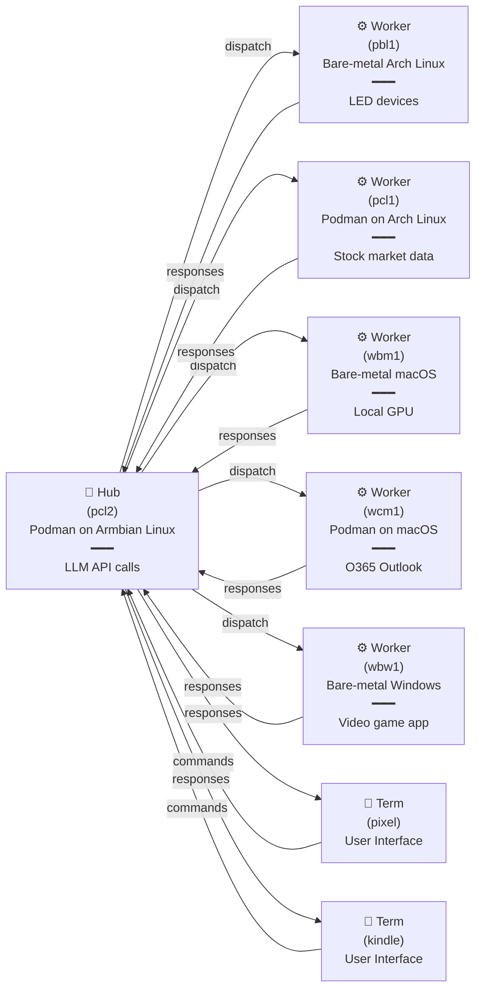

# Logical Network Architecture

In an example cluster:

Where:

- `pcl2` connects to AI APIs (e.g., xAI) to execute LLM prompt commands and return responses to the requester (hub, worker, or term may each request llm responses. but only hub and worker can execute tool_call fns.)
- `pbl1` connects to LED light devices (on desk, and in PC chassis)
- human operators are using (`pixel`, `kindle`) (one session per-device)
- `pcl1` runs tool_call fns for controlling
  - gathering stock market data
- `wbm1` runs tool_call fns for controlling
  - local gpu
- `wcm1` runs tool_call fns for controlling
  - o365 outlook mail and calendar
- `wbw1` runs tool_call fns for controlling
  - a video game application (for testing game changes)

## References

- read `ai/docs/ROLES.md`
- read `ai/docs/AGENT_TEMPLATES.md`
- read `ai/docs/TOOL_CALLS.md`
- read `ai/docs/MODES.md`
- read `ai/docs/NET_PROTO.md`
- read `ai/docs/NET_MSGS.md`