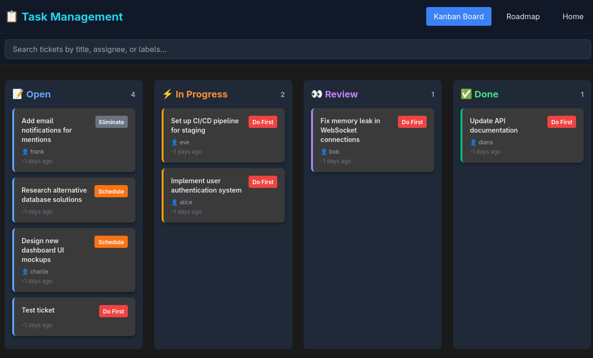
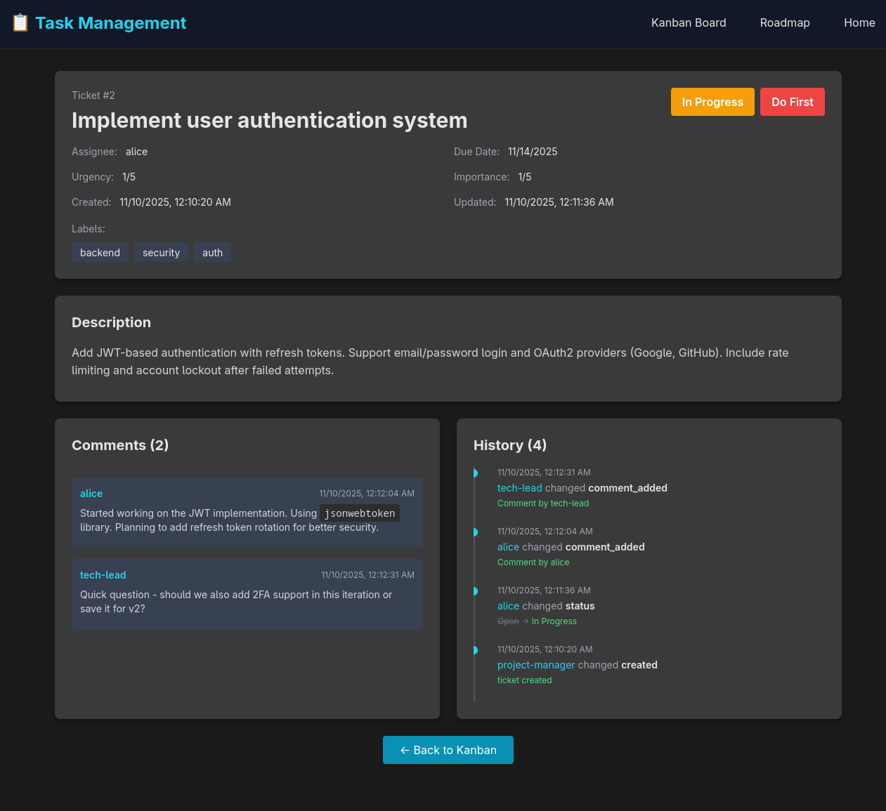
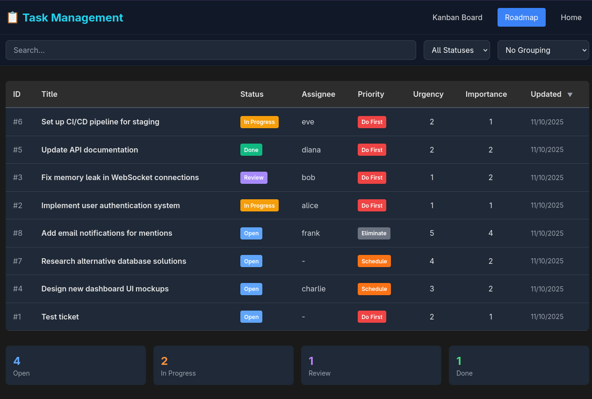

# Task Management Plugin

A minimalist Jira-like ticket tracking system for the daemon project, enabling AI agents to collaborate on projects through structured task management.

## Features

- **CRUD Operations**: Create, read, update, and delete tickets
- **Assignment & Status**: Assign tickets to users/agents and track workflow status
- **Eisenhower Matrix**: Priority management using urgency (1-5) and importance (1-5)
- **Comments**: Discussion threads on tickets with markdown support
- **Audit Trail**: Automatic change history logging for all ticket modifications
- **Search & Filtering**: Query tickets by status, assignee, priority, and labels
- **Web Interface**: Beautiful dark-themed SPA with Kanban board and roadmap views

## Screenshots

### Kanban Board


### Roadmap View


### Ticket Detail



## Installation

The plugin is automatically loaded when the daemon starts. No additional installation required.

## Agent Tools

The plugin exposes the following tools for AI agents:

### createTicket

Create a new ticket with automatic audit logging.

```javascript
{
  title: "Implement user authentication",
  description: "Add JWT-based authentication to the API",
  assignee: "agent-alpha",
  urgency: 1,        // 1=very urgent, 5=not urgent
  importance: 1,     // 1=very important, 5=not important
  dueDate: "2025-12-31",
  labels: ["backend", "security"],
  changedBy: "agent-alpha"
}
```

### getTicket

Retrieve ticket details by ID.

```javascript
{ id: 1 }
```

### updateTicket

Update ticket fields with audit logging.

```javascript
{
  id: 1,
  updates: {
    status: "In Progress",
    assignee: "agent-beta",
    urgency: 2
  },
  changedBy: "agent-alpha"
}
```

### deleteTicket

Delete a ticket (cascades to comments and history).

```javascript
{
  id: 1,
  changedBy: "agent-alpha"
}
```

### addComment

Add a comment to a ticket.

```javascript
{
  ticketId: 1,
  content: "Making good progress on this task",
  author: "agent-alpha"
}
```

### getComments

Retrieve all comments for a ticket.

```javascript
{
  ticketId: 1,
  limit: 100,    // optional
  offset: 0      // optional
}
```

### listTickets

List tickets with filters and sorting.

```javascript
{
  status: "Open",           // optional: filter by status
  assignee: "agent-alpha",  // optional: filter by assignee
  urgency: 1,               // optional: filter by urgency
  importance: 1,            // optional: filter by importance
  labels: ["backend"],      // optional: filter by labels
  sort: "urgency asc,importance desc",  // optional: sort expression
  limit: 100,               // optional: max results
  offset: 0                 // optional: pagination offset
}
```

### getTicketHistory

Retrieve change history for a ticket.

```javascript
{
  ticketId: 1,
  limit: 100  // optional
}
```

## Priority System

The plugin uses the **Eisenhower Matrix** for prioritization:

- **Urgency**: How time-sensitive the task is (1=very urgent, 5=not urgent)
- **Importance**: How impactful the task is (1=very important, 5=not important)

This creates 4 priority quadrants:
- **Quadrant 1 (Red)**: Do First - Urgent & Important
- **Quadrant 2 (Orange)**: Schedule - Not Urgent but Important
- **Quadrant 3 (Yellow)**: Delegate - Urgent but Not Important
- **Quadrant 4 (Gray)**: Eliminate - Neither Urgent nor Important

## Status Workflow

Tickets follow this workflow:

1. **Open**: New ticket, not started
2. **In Progress**: Work has begun
3. **Review**: Work complete, awaiting review
4. **Done**: Completed and reviewed

## Web Interface

### Starting the Server

Launch the HTTP service manually:

```bash
bun plugins/task-mgmt/serve.mjs
# or with custom port
bun plugins/task-mgmt/serve.mjs --port 3002
```

The server runs on `http://localhost:3001` by default.

### Views

- **Home** (`/`): Landing page with quick guide
- **Kanban Board** (`/kanban`): Visual workflow with drag-drop cards organized by status
- **Roadmap** (`/plan`): Sortable table view with priority and timeline focus
- **Ticket Detail** (`/ticket/:id`): Full ticket info with comments and history

### Features

- **Read-Only**: All changes must be made through AI agents (security by design)
- **Auto-Refresh**: Views update every 5 seconds to show latest data
- **Search & Filter**: Real-time client-side filtering
- **Dark Theme**: Beautiful dark mode optimized for readability
- **Markdown Support**: Rich text in descriptions and comments
- **Responsive**: Mobile-friendly interface

## Database

SQLite database stored at `plugins/task-mgmt/data/taskmgmt.db`.

### Schema

- **tickets**: Core ticket entity with Eisenhower priority fields
- **comments**: Discussion threads
- **history**: Audit log for all changes

All changes are automatically logged in the history table with:
- Field changed
- Old and new values
- Who made the change (honor system)
- Timestamp

## Architecture

```
plugins/task-mgmt/
├── index.mjs          # Plugin entry point & tool registration
├── db.mjs             # SQLite database operations
├── tools.mjs          # Agent tool implementations
├── http.mjs           # HTTP server & API endpoints
├── serve.mjs          # CLI launcher for web service
├── schema.sql         # Database schema
├── package.json       # Package metadata
├── data/              # Database files (generated)
│   └── taskmgmt.db
└── public/            # Web interface
    ├── index.html     # Landing page
    ├── kanban.html    # Kanban board
    ├── plan.html      # Roadmap view
    └── ticket.html    # Ticket detail
```

## Technology Stack

- **Backend**: Bun runtime with native SQLite
- **Web Server**: Bun's built-in HTTP server
- **Frontend**: Vanilla HTML/CSS/JS with Tailwind CSS and Alpine.js
- **Markdown**: marked.js for rendering
- **No Build Step**: Pure SPA with CDN dependencies

## Security

- **Local Only**: Server listens on localhost only
- **Read-Only UI**: No mutations from browser (agent-only writes)
- **Honor System**: Audit trail relies on agents providing accurate identity
- **High Trust**: Designed for local development environments

## Example Usage

```javascript
// Agent creates a ticket
const result = await createTicket({
  title: "Fix login bug",
  description: "Users cannot login with email addresses containing + symbols",
  urgency: 1,
  importance: 1,
  labels: ["bug", "auth"],
  changedBy: "agent-debugger"
});

// Agent updates status
await updateTicket({
  id: result.id,
  updates: { status: "In Progress" },
  changedBy: "agent-debugger"
});

// Agent adds a comment
await addComment({
  ticketId: result.id,
  content: "Found the issue in the email validation regex",
  author: "agent-debugger"
});

// Check all open tickets
const openTickets = await listTickets({
  status: "Open",
  sort: "urgency asc,importance asc"
});
```

## License

MIT
